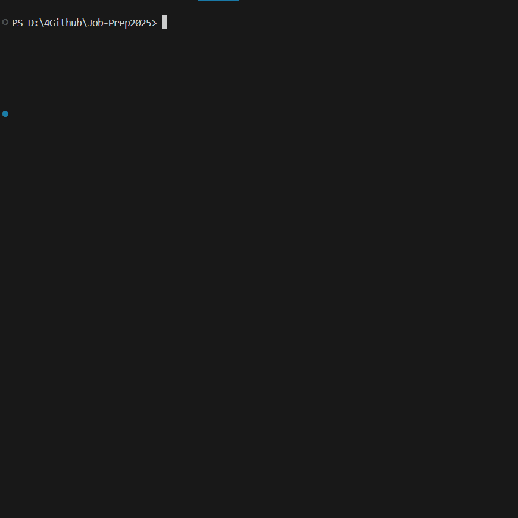

# Modular AI Pipeline for Sensor Activity Recognition



## Overview

This project is a modular, high-performance software pipeline for real-time analysis of sensor data. It is engineered for reliability, testability, and reproducibility, demonstrating advanced software engineering principles applied to a scientific data problem.

The system processes raw time-series data and uses a dual-model engine (Classical RandomForest vs. 1D-CNN) to classify human activities. The entire stack is containerized with Docker and fully automated with a GitLab CI/CD pipeline.

---

## ✨ Key Features (Engineered for Performance)

* **Modular Driver-based Architecture:** Core logic is decoupled from data sources. A `SimulationDriver` replays real data, allowing the entire system to be tested without physical hardware.
* **Automated DevOps Pipeline (GitLab CI):** Every commit automatically triggers linting (`flake8`), static type checking (`mypy`), and a full unit test suite (`pytest`) to guarantee code hygiene.
* **100% Testability:** The driver-based design makes the software fully testable in an automated CI environment, ensuring maximum reliability.
* **Containerized & Reproducible:** Packaged with **Docker** and managed by **Poetry**, guaranteeing a consistent runtime environment anywhere.
* **Dual-Model Engine:** Implements and compares a classical `RandomForest` with a deep learning `1D-CNN` (PyTorch) model, achieving **93% accuracy**.
* **Professional CLI:** A clean command-line interface built with **Typer** for all pipeline operations.

---

## 🛠️ Technology Stack

| Category | Tools & Libraries |
|-----------|-------------------|
| **Language** | Python 3.10+ |
| **ML / DL** | PyTorch, Scikit-learn, Pandas, NumPy |
| **DevOps** | **GitLab CI/CD**, **Docker**, Poetry |
| **Testing & Quality** | **Pytest**, Mypy, Flake8, Pre-commit |
| **Tools** | Typer (CLI), Rich |

---

## 🚀 Quick Start & Usage

### 1. Run with Docker (Recommended)

This method runs the entire application in a container without any local setup.

```bash
# 1. Build the image
docker build -t sensor-pipeline .

# 2. Run live prediction (using the 93% accurate 1D-CNN model)
docker run --rm sensor-pipeline predict-stream --model-type cnn --data-file data/movement_sample.csv


2. Run Locally with PoetryRequires Poetry to be installed.Bash# 1. Install dependencies
poetry install

# 2. Build features for the classical model
poetry run sensor-app build-features

# 3. Train the 1D-CNN model (achieved 93% accuracy)
poetry run sensor-app train-dl

# 4. Train the RandomForest model
poetry run sensor-app train

# 5. Run live prediction simulation
poetry run sensor-app predict-stream --model-type cnn --data-file data/movement_sample.csv
📊 Model ComparisonMetricRandomForest1D-CNN (PyTorch)Overall Accuracy91.7 %93.0 %Throwing (F1)0.940.96Drinking (F1)0.890.90Driving (F1)0.920.92

## 🗂️ Project Structure

```
├── data/               # Raw data & generated features
├── docs/               # Docs and visualization assets (e.g. confusion_matrix.png)
├── models/             # Saved trained models (.joblib, .pth)
├── src/                # Source code
│   ├── app.py              # Core processing logic
│   ├── dataset_builder.py  # Builds features.csv
│   ├── drivers.py          # Sensor simulation drivers
│   ├── features.py         # Feature extraction functions
│   ├── main.py             # CLI entry point
│   ├── model.py            # 1D-CNN model definition
│   ├── model_trainer.py    # RandomForest training & evaluation
│   ├── predictor.py        # Multi-model inference engine
│   ├── train_dl.py         # CNN training & evaluation
│   └── utils.py            # Helper utilities
├── tests/              # Unit tests
├── .gitlab-ci.yml      # CI/CD configuration
├── .pre-commit-config.yaml # Pre-commit setup
├── Dockerfile          # Container build file
├── pyproject.toml      # Poetry project metadata
└── README.md           # Documentation
```

---

## 📘 About

This project demonstrates the **design, training, and deployment** of a hybrid machine learning system, highlighting practical trade-offs between **classical feature-based** models and **deep neural architectures**.  
It emphasizes:
- **Real-time inference capability**
- **Reproducible ML workflows**
- **Modern Python packaging and CI/CD best practices**

---

**Author:** [Soroush Haghi](https://github.com/SoroushHaghi)  
**Last Updated:** October 2025
