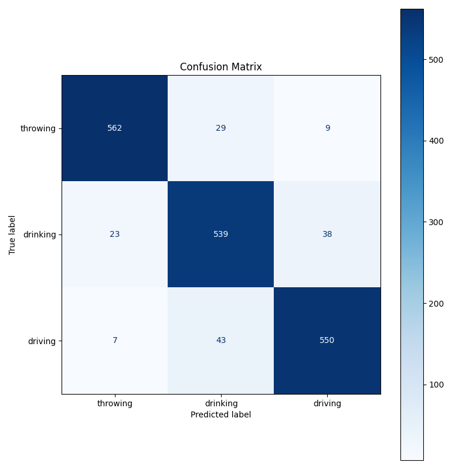

# Real-Time Multi-Class Activity Recognition from Sensor Data

## 🚀 Project Overview

This project implements a complete end-to-end pipeline for classifying human activities (throwing, drinking, driving) in real-time based on simulated accelerometer data. It includes data processing, feature extraction, model training, a command-line interface (CLI) for interaction, and a real-time inference engine. The entire workflow is automated with pre-commit hooks and a GitLab CI/CD pipeline.

## ✨ Features

* **Data Processing:** Reads raw sensor data (CSV), handles different column naming conventions (`X/Y/Z`, `x/y/z`, `acc_x/acc_y/acc_z`), and prepares it for analysis.
* **Feature Extraction:** Calculates statistical features (mean, standard deviation, RMS) over sliding windows of sensor data.
* **Multi-Class Model Training:** Trains a `RandomForestClassifier` to distinguish between three distinct activities: throwing, drinking, and driving.
* **Model Evaluation:** Evaluates model performance using accuracy, classification reports, and visualizes results with a confusion matrix.
* **Real-Time Inference:** Simulates a live sensor stream and uses the trained model to predict the current activity window by window.
* **Command-Line Interface (CLI):** Provides user-friendly commands (`build-features`, `train`, `predict-stream`) built with Typer and Rich for easy interaction.
* **Automated Workflow:**
    * **GitLab CI/CD:** Automatically runs linting (`flake8`) and unit tests (`pytest`) on every push to ensure code quality and prevent regressions.
    * **Pre-commit Hooks:** Automatically formats code (`black`), lints (`flake8`), and runs tests (`pytest`) before each commit, ensuring consistency and catching errors early.
* **Dependency Management:** Uses Poetry for robust dependency management and virtual environment handling.

## 🛠️ Technology Stack

* **Language:** Python 3.10+
* **Core Libraries:** Pandas, NumPy, Scikit-learn, Joblib
* **CLI:** Typer, Rich
* **Testing:** Pytest, Pytest-Mock
* **Code Quality:** Black, Flake8
* **Automation:** Pre-commit, GitLab CI/CD
* **Package Management:** Poetry
* **Visualization:** Matplotlib (for confusion matrix)

## ⚙️ Installation & Setup

1.  **Clone the repository:**
    ```bash
    git clone <your-repository-url>
    cd Job-Prep2025 # Or your repository name
    ```

2.  **Install Poetry:** (If you don't have it installed)
    Follow the instructions on the [official Poetry website](https://python-poetry.org/docs/#installation).

3.  **Install dependencies:**
    Poetry will automatically create a virtual environment (`.venv`) inside the project directory and install all required packages.
    ```bash
    poetry install
    ```

4.  **Activate pre-commit hooks:**
    This installs the git hooks defined in `.pre-commit-config.yaml`.
    ```bash
    poetry run pre-commit install
    ```

## ▶️ Usage

All commands are run using `poetry run python -m src.main <command>`.

1.  **Build Feature Dataset:**
    Processes the raw data files (`data/throwing.csv`, `data/drinking.csv`, `data/driving.csv`), calculates features, and saves them to `data/features.csv`.
    ```bash
    poetry run python -m src.main build-features
    ```

2.  **Train the Model:**
    Loads `data/features.csv`, trains the `RandomForestClassifier`, evaluates it, saves the model to `models/activity_classifier.joblib`, and generates the confusion matrix plot at `docs/confusion_matrix.png`.
    ```bash
    poetry run python -m src.main train
    ```

3.  **Run Real-Time Inference Simulation:**
    Simulates a live stream using one of the data files and predicts the activity using the trained model.

    * **Predicting "Throwing":**
        ```bash
        poetry run python -m src.main predict-stream --data-file data/throwing.csv
        ```
    * **Predicting "Drinking":**
        ```bash
        poetry run python -m src.main predict-stream --data-file data/drinking.csv
        ```
    * **Predicting "Driving":**
        ```bash
        poetry run python -m src.main predict-stream --data-file data/driving.csv
        ```

    *(You can also specify `--model-file` and `--window-size` arguments).*

## 📊 Model Performance

The model was trained to classify three activities: throwing, drinking, and driving. Performance on the test set (approx. 91.7% accuracy) is visualized in the confusion matrix below:



*(Add any specific observations about the matrix here, e.g., "The model performs well but occasionally confuses drinking and driving.")*

## 📁 Project Structure
├── data/ # Raw data files (throwing.csv, etc.) and generated features.csv ├── docs/ # Documentation files (e.g., confusion_matrix.png) ├── models/ # Saved trained model (activity_classifier.joblib) ├── src/ # Main source code │ ├── init.py │ ├── app.py # Core processing logic, constants │ ├── dataset_builder.py # Script to build features.csv │ ├── drivers.py # Sensor driver classes (SimulationDriver, MockSensor) │ ├── features.py # Feature calculation functions │ ├── main.py # CLI definition using Typer │ ├── model_trainer.py # Model training and evaluation script │ └── predictor.py # Class for loading model and making predictions ├── tests/ # Unit tests │ ├── init.py │ └── test_*.py # Pytest files for different modules ├── .gitignore ├── .gitlab-ci.yml # GitLab CI/CD configuration ├── .pre-commit-config.yaml # Pre-commit hook configuration ├── poetry.lock # Poetry lock file ├── pyproject.toml # Poetry project configuration and dependencies └── README.md # This file


## 🤖 Automation

* **Local Development:** `pre-commit` automatically ensures code formatting (Black), linting (Flake8), and passing tests (Pytest) before every commit.
* **Continuous Integration:** The GitLab CI/CD pipeline (`.gitlab-ci.yml`) automatically runs `flake8` and `pytest` on every push to the repository, ensuring code quality and preventing integration issues.

---

*(Optional: Add a "Future Work" section here to list potential improvements like hyperparameter tuning, adding more features, trying different models, or using real sensor hardware.)*